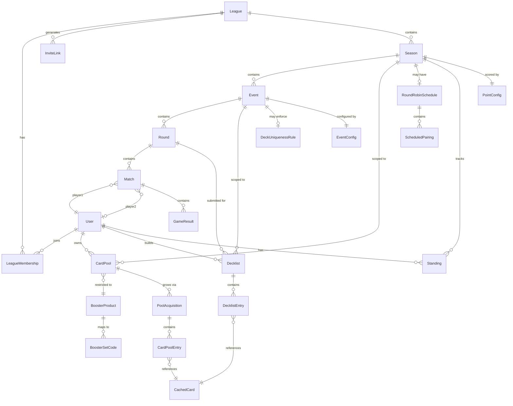

# Data Model

## 1. Overview

This document describes the persistent data model for the MTG Chaperone web application. The system manages leagues, seasons, events, matches, card pools, and decklists for Magic: The Gathering box-league play.



---

## 2. Entity Groups

### Identity & Membership

#### User

| Field | Type | Constraints | Description |
|---|---|---|---|
| id | UUID | PK | Primary identifier |
| discordId | string | unique, nullable | Discord OAuth subject |
| googleId | string | unique, nullable | Google OAuth subject |
| displayName | string | not null | Publicly visible name |
| slug | string | unique, not null | URL-safe handle (e.g. `/u/sparky`) |
| avatarUrl | string | nullable | Profile image URL |
| createdAt | timestamp | not null | Row creation time |
| updatedAt | timestamp | not null | Last modification time |

#### League

| Field | Type | Constraints | Description |
|---|---|---|---|
| id | UUID | PK | Primary identifier |
| name | string | not null | Display name of the league |
| slug | string | unique, not null | URL-safe handle (e.g. `/league/friday-night`) |
| description | text | nullable | Freeform league description |
| logoUrl | string | nullable | League logo image URL |
| bannerUrl | string | nullable | League banner image URL |
| poolVisibility | boolean | default `true` | Whether card pools are public to all members |
| decklistVisibility | boolean | default `true` | Whether decklists are public to all members |
| scheduleVisibility | boolean | default `true` | Whether future round-robin pairings are visible |
| createdAt | timestamp | not null | Row creation time |
| updatedAt | timestamp | not null | Last modification time |

#### LeagueMembership

| Field | Type | Constraints | Description |
|---|---|---|---|
| id | UUID | PK | Primary identifier |
| userId | UUID | FK → User, not null | The member |
| leagueId | UUID | FK → League, not null | The league joined |
| role | enum | `admin` \| `player` | Permission level within the league |
| joinedAt | timestamp | not null | When the user joined |

**Unique constraint:** `(userId, leagueId)` — a user can only hold one membership per league.

#### InviteLink

| Field | Type | Constraints | Description |
|---|---|---|---|
| id | UUID | PK | Primary identifier |
| leagueId | UUID | FK → League, not null | League this invite belongs to |
| token | string | unique, not null | Opaque token used in the invite URL |
| status | enum | `active` \| `revoked` | Whether the link can still be used |
| maxUses | int | nullable | Optional cap on total redemptions |
| useCount | int | default `0` | How many times the link has been used |
| expiresAt | timestamp | nullable | Optional expiry; `null` means no expiry |
| createdById | UUID | FK → User, not null | Admin who generated the link |
| createdAt | timestamp | not null | Row creation time |

---

### Season & Scoring

#### Season

| Field | Type | Constraints | Description |
|---|---|---|---|
| id | UUID | PK | Primary identifier |
| leagueId | UUID | FK → League, not null | Parent league |
| name | string | not null | Display name (e.g. "Spring 2026") |
| number | int | not null | Ordinal within the league (1-based) |
| tradingEnabled | boolean | default `false` | Whether card trading is allowed this season |
| isActive | boolean | default `false` | Whether this is the league's current season |
| createdAt | timestamp | not null | Row creation time |
| updatedAt | timestamp | not null | Last modification time |

#### PointConfig

| Field | Type | Constraints | Description |
|---|---|---|---|
| id | UUID | PK | Primary identifier |
| seasonId | UUID | FK → Season, unique, not null | One config per season |
| matchWinPoints | int | default `3` | Points awarded for a match win |
| matchDrawPoints | int | default `1` | Points awarded for a match draw |
| matchLossPoints | int | default `0` | Points awarded for a match loss |
| gameWinPoints | int | default `0` | Bonus points per individual game win |
| sweepBonusPoints | int | default `0` | Bonus points for winning all games in a match |

#### Standing

| Field | Type | Constraints | Description |
|---|---|---|---|
| id | UUID | PK | Primary identifier |
| seasonId | UUID | FK → Season, not null | Season these standings belong to |
| userId | UUID | FK → User, not null | The player |
| points | int | not null | Total accumulated points |
| matchWins | int | not null | Total match wins |
| matchLosses | int | not null | Total match losses |
| matchDraws | int | not null | Total match draws |
| gameWins | int | not null | Total individual game wins |
| gameLosses | int | not null | Total individual game losses |
| omwPercent | float | not null | Opponent match-win percentage (tiebreaker) |
| gwPercent | float | not null | Game-win percentage (tiebreaker) |
| ogwPercent | float | not null | Opponent game-win percentage (tiebreaker) |
| updatedAt | timestamp | not null | Last recalculation time |

**Unique constraint:** `(seasonId, userId)` — one standing row per player per season.

---

### Events & Rounds

#### Event

| Field | Type | Constraints | Description |
|---|---|---|---|
| id | UUID | PK | Primary identifier |
| seasonId | UUID | FK → Season, not null | Parent season |
| name | string | not null | Display name (e.g. "Week 3") |
| status | enum | `setup` \| `active` \| `completed` | Current lifecycle state |
| pointMultiplier | float | default `1.0` | Scaling factor applied to points earned in this event |
| standingsOverride | boolean | default `false` | If true, this event uses its own isolated standings |
| orderIndex | int | not null | Display/sort order within the season |
| createdAt | timestamp | not null | Row creation time |
| updatedAt | timestamp | not null | Last modification time |

#### EventConfig

| Field | Type | Constraints | Description |
|---|---|---|---|
| id | UUID | PK | Primary identifier |
| eventId | UUID | FK → Event, unique, not null | One config per event |
| format | enum | `swiss` \| `seeded_swiss` \| `round_robin` | Pairing algorithm |
| bestOfN | int | default `3` | Games per match (1, 3, or 5) |
| deckCount | int | default `1` | Number of decks a player must submit |
| minDeckSize | int | default `40` | Minimum main-deck size |
| sideboardRule | enum | `entire_pool` \| `fixed_15` \| `none` | Sideboard construction rule |
| schedulingType | enum | `fixed_deadlines` \| `open_window` \| `weekly_auto` | How round timing is managed |
| deckLockingMode | enum | `required_before_round` \| `free_modification` \| `admin_locked` | When decks become immutable |
| seedingSource | enum | `previous_season` \| `previous_event` \| `manual`, nullable | How initial seeding is derived (seeded swiss only) |

#### Round

| Field | Type | Constraints | Description |
|---|---|---|---|
| id | UUID | PK | Primary identifier |
| eventId | UUID | FK → Event, not null | Parent event |
| roundNumber | int | not null | Ordinal within the event (1-based) |
| status | enum | `not_started` \| `in_progress` \| `completed` | Current lifecycle state |
| deadline | timestamp | nullable | Optional deadline for match completion |
| createdAt | timestamp | not null | Row creation time |

#### PlayerDrop

| Field | Type | Constraints | Description |
|---|---|---|---|
| id | UUID | PK | Primary identifier |
| userId | UUID | FK → User, not null | Player being dropped |
| seasonId | UUID | FK → Season, not null | Season scope for the drop |
| eventId | UUID | FK → Event, nullable | Event-only drop when present; season-wide when null |
| reason | text | nullable | Admin note for the drop |
| droppedById | UUID | FK → User, not null | Admin who executed the drop |
| droppedAt | timestamp | default now | When the drop was recorded |

#### RoundRobinSchedule

| Field | Type | Constraints | Description |
|---|---|---|---|
| id | UUID | PK | Primary identifier |
| seasonId | UUID | FK → Season, unique, not null | One schedule per season |
| createdAt | timestamp | not null | Row creation time |

Pre-computed full round-robin schedule for a season. Generated once when the season is configured for round-robin play, then individual pairings are slotted into events/rounds as they are created.

#### ScheduledPairing

| Field | Type | Constraints | Description |
|---|---|---|---|
| id | UUID | PK | Primary identifier |
| scheduleId | UUID | FK → RoundRobinSchedule, not null | Parent schedule |
| player1Id | UUID | FK → User, not null | First player |
| player2Id | UUID | FK → User, not null | Second player |
| eventId | UUID | FK → Event, nullable | Assigned event (null if not yet scheduled) |
| roundId | UUID | FK → Round, nullable | Assigned round (null if not yet scheduled) |

---

### Matches

#### Match

| Field | Type | Constraints | Description |
|---|---|---|---|
| id | UUID | PK | Primary identifier |
| roundId | UUID | FK → Round, not null | Parent round |
| player1Id | UUID | FK → User, not null | First player (or bye recipient) |
| player2Id | UUID | FK → User, nullable | Second player; `null` for byes |
| isBye | boolean | default `false` | Whether this match is an automatic bye |
| status | enum | `pending` \| `reported` \| `confirmed` \| `disputed` \| `resolved` | Current lifecycle state |
| reportedById | UUID | FK → User, nullable | Player who first reported the result |
| confirmedAt | timestamp | nullable | When the opponent confirmed the result |
| createdAt | timestamp | not null | Row creation time |

#### GameResult

| Field | Type | Constraints | Description |
|---|---|---|---|
| id | UUID | PK | Primary identifier |
| matchId | UUID | FK → Match, not null | Parent match |
| gameNumber | int | not null | Ordinal within the match (1-based) |
| winnerId | UUID | FK → User, nullable | Game winner; `null` for draws |
| isDraw | boolean | default `false` | Whether the game ended in a draw |
| notes | text | nullable | Optional notes (e.g. concession, timeout) |

---

### Card Pools

#### BoosterProduct

| Field | Type | Constraints | Description |
|---|---|---|---|
| id | UUID | PK | Primary identifier |
| name | string | not null | Display name (e.g. "Foundations Play Booster Box") |
| setReleaseName | string | not null | Human-readable set name (e.g. "Foundations") |
| boosterType | enum | `draft` \| `play` \| `set` \| `collector` | Product category |
| createdAt | timestamp | not null | Row creation time |

#### BoosterSetCode

| Field | Type | Constraints | Description |
|---|---|---|---|
| id | UUID | PK | Primary identifier |
| boosterProductId | UUID | FK → BoosterProduct, not null | Parent product |
| setCode | string(10) | not null | Scryfall set code (e.g. `fdn`, `spg`) |

**Unique constraint:** `(boosterProductId, setCode)` — a product maps to each set code at most once.

#### CardPool

| Field | Type | Constraints | Description |
|---|---|---|---|
| id | UUID | PK | Primary identifier |
| userId | UUID | FK → User, not null | Pool owner |
| seasonId | UUID | FK → Season, not null | Season this pool belongs to |
| boosterProductId | UUID | FK → BoosterProduct, not null | Restricts which cards are allowed |
| verificationMode | enum | `honor_system` \| `admin_approval` \| `peer_approval` | How new acquisitions are verified |
| createdAt | timestamp | not null | Row creation time |
| updatedAt | timestamp | not null | Last modification time |

**Unique constraint:** `(userId, seasonId)` — one pool per player per season.

#### PoolAcquisition

| Field | Type | Constraints | Description |
|---|---|---|---|
| id | UUID | PK | Primary identifier |
| cardPoolId | UUID | FK → CardPool, not null | Parent pool |
| phaseLabel | string | not null | Describes when/why cards were added (e.g. "Initial 6 packs", "Prize pack week 2") |
| approvalStatus | enum | `pending` \| `approved` \| `rejected` | Verification status |
| addedAt | timestamp | not null | When the acquisition was recorded |

#### CardPoolEntry

| Field | Type | Constraints | Description |
|---|---|---|---|
| id | UUID | PK | Primary identifier |
| acquisitionId | UUID | FK → PoolAcquisition, not null | Parent acquisition batch |
| cachedCardId | string | FK → CachedCard, not null | The card |
| quantity | int | min `1`, not null | Number of copies in this acquisition |

---

### Decklists

#### Decklist

| Field | Type | Constraints | Description |
|---|---|---|---|
| id | UUID | PK | Primary identifier |
| userId | UUID | FK → User, not null | Deck builder |
| eventId | UUID | FK → Event, not null | Event this deck is for |
| roundId | UUID | FK → Round, not null | Round this deck is submitted for |
| name | string | nullable | Optional deck name |
| status | enum | `draft` \| `submitted` \| `locked` | Current lifecycle state |
| createdAt | timestamp | not null | Row creation time |
| updatedAt | timestamp | not null | Last modification time |

#### DecklistEntry

| Field | Type | Constraints | Description |
|---|---|---|---|
| id | UUID | PK | Primary identifier |
| decklistId | UUID | FK → Decklist, not null | Parent decklist |
| cachedCardId | string | FK → CachedCard, not null | The card |
| quantity | int | min `1`, not null | Number of copies |
| zone | enum | `main` \| `sideboard` | Where in the deck this entry belongs |

#### DeckUniquenessRule

| Field | Type | Constraints | Description |
|---|---|---|---|
| id | UUID | PK | Primary identifier |
| eventId | UUID | FK → Event, unique, not null | One rule per event |
| constraintType | string | not null | Rule identifier (e.g. `no_repeat_decks`, `no_repeat_cards`) |
| parameters | JSON | not null | Rule-specific configuration |

Allows events to enforce constraints such as "you cannot submit the same 40 cards you used in a previous round." The `parameters` blob holds thresholds and scope details specific to each `constraintType`.

---

### Scryfall Cache

#### CachedCard

| Field | Type | Constraints | Description |
|---|---|---|---|
| scryfallId | string | PK | Scryfall's unique print identifier |
| name | string | not null | Card name |
| manaCost | string | nullable | Mana cost string (e.g. `{2}{W}{U}`) |
| typeLine | string | not null | Full type line (e.g. "Creature — Human Wizard") |
| oracleText | text | nullable | Rules text |
| colors | string[] | not null | Card colors (`W`, `U`, `B`, `R`, `G`) |
| colorIdentity | string[] | not null | Color identity for deck-building |
| cmc | float | not null | Mana value |
| rarity | string | not null | `common`, `uncommon`, `rare`, `mythic` |
| setCode | string | not null | Set code (matches BoosterSetCode entries) |
| imageUris | JSON | nullable | Map of image sizes to URLs |
| prices | JSON | nullable | Price data snapshot (`usd`, `usd_foil`, etc.) |
| lastFetched | timestamp | not null | When this row was last refreshed from Scryfall |

---

### Future Entities (P2)

These entities are not yet modeled but are planned for future phases:

- **Trade** — Represents a card trade between two players within a season. Will reference `CardPoolEntry` rows and require both parties to confirm.
- **Notification** — In-app notification system for match reminders, trade requests, round deadlines, and league announcements. Will support multiple delivery channels (in-app, Discord webhook).

---

## 3. Lifecycle State Machines

### Event

```
setup ──→ active ──→ completed
```

| State | Description |
|---|---|
| `setup` | Admin is configuring the event. Rounds and pairings have not yet been created. EventConfig can still be modified. |
| `active` | The event is live. At least one round has been generated with pairings. Players can report match results. |
| `completed` | All rounds are completed, or the admin has manually closed the event. Results are final. |

| Transition | Trigger |
|---|---|
| `setup` → `active` | Admin starts the event; first-round pairings are generated. |
| `active` → `completed` | All rounds reach `completed` status, or admin manually closes the event. |

---

### Round

```
not_started ──→ in_progress ──→ completed
```

| State | Description |
|---|---|
| `not_started` | The round exists but pairings may not yet be finalized. |
| `in_progress` | Pairings are finalized and visible to players. Match results can be reported. |
| `completed` | All matches in the round are confirmed or resolved. |

| Transition | Trigger |
|---|---|
| `not_started` → `in_progress` | Pairings are finalized (manually or by the pairing algorithm). |
| `in_progress` → `completed` | Every match in the round reaches `confirmed` or `resolved` status. |

---

### Match

```
pending ──→ reported ──→ confirmed
                  │
                  └──→ disputed ──→ resolved
```

| State | Description |
|---|---|
| `pending` | Match has been created with a pairing but no results have been submitted. |
| `reported` | One player has submitted game results. Awaiting opponent confirmation. |
| `confirmed` | The opponent confirmed the reported results. Match is final. |
| `disputed` | The opponent disputes the reported results. Awaiting admin resolution. |
| `resolved` | An admin has manually set the final result after a dispute. |

| Transition | Trigger |
|---|---|
| `pending` → `reported` | A player submits game results for the match. |
| `reported` → `confirmed` | The opponent confirms the reported results. |
| `reported` → `disputed` | The opponent disputes the reported results. |
| `disputed` → `resolved` | An admin manually sets the final result. |

---

### Decklist

```
draft ──→ submitted ──→ locked
              │
              └──→ draft  (un-submit, if allowed)
```

| State | Description |
|---|---|
| `draft` | Player is building or editing the deck. Not yet visible to opponents. |
| `submitted` | Player has submitted the deck for the round. May still be retracted depending on event config. |
| `locked` | The deck is immutable. Locked by admin action or automatically when the round begins (per `deckLockingMode`). |

| Transition | Trigger |
|---|---|
| `draft` → `submitted` | Player submits the deck for the round. |
| `submitted` → `locked` | Admin locks decks, or the round begins (when `deckLockingMode` is `required_before_round`). |
| `submitted` → `draft` | Player un-submits before lock, if permitted by the event's `deckLockingMode` setting. |

---

## 4. Indexes

| Table | Column(s) | Type | Purpose |
|---|---|---|---|
| User | `slug` | unique | URL lookups |
| User | `discordId` | unique | OAuth login |
| User | `googleId` | unique | OAuth login |
| League | `slug` | unique | URL lookups |
| LeagueMembership | `(userId, leagueId)` | unique composite | Enforce one membership per user per league |
| Season | `(leagueId, number)` | unique composite | Enforce unique season numbers within a league |
| Standing | `(seasonId, userId)` | unique composite | One standing per player per season |
| Standing | `(seasonId, points DESC)` | non-unique | Fast leaderboard/standings queries |
| Match | `roundId` | non-unique | Fetch all matches in a round |
| Match | `player1Id` | non-unique | Fetch matches by player |
| Match | `player2Id` | non-unique | Fetch matches by player |
| Match | `status` | non-unique | Filter by lifecycle state |
| CardPool | `(userId, seasonId)` | unique composite | One pool per player per season |
| CachedCard | `setCode` | non-unique | Filter cards by set |
| CachedCard | `name` | non-unique | Card name search |
| Decklist | `(userId, eventId, roundId)` | non-unique | Lookup a player's deck for a specific round |
| DecklistEntry | `decklistId` | non-unique | Fetch all entries in a decklist |
| CardPoolEntry | `acquisitionId` | non-unique | Fetch all entries in an acquisition batch |
| InviteLink | `token` | unique | Token-based invite redemption |

---

## 5. Privacy Model

Three boolean flags on the **League** entity control data visibility for members and spectators:

| Flag | Default | When `false` |
|---|---|---|
| `poolVisibility` | `true` | Only the pool owner and league admins can view a player's card pool. Other members and spectators cannot see it. |
| `decklistVisibility` | `true` | Only the decklist owner and league admins can view a player's decklists. Other members and spectators cannot see them. |
| `scheduleVisibility` | `true` | Future round-robin pairings are hidden from players. Only the current event's pairings are visible. Admins can always see the full schedule. |

**Baseline visibility (always public regardless of flags):**

- Standings and leaderboard data
- Recent match results (winner, score)

These defaults ensure leagues are open and transparent out of the box, while giving admins the option to restrict information for more competitive formats.
