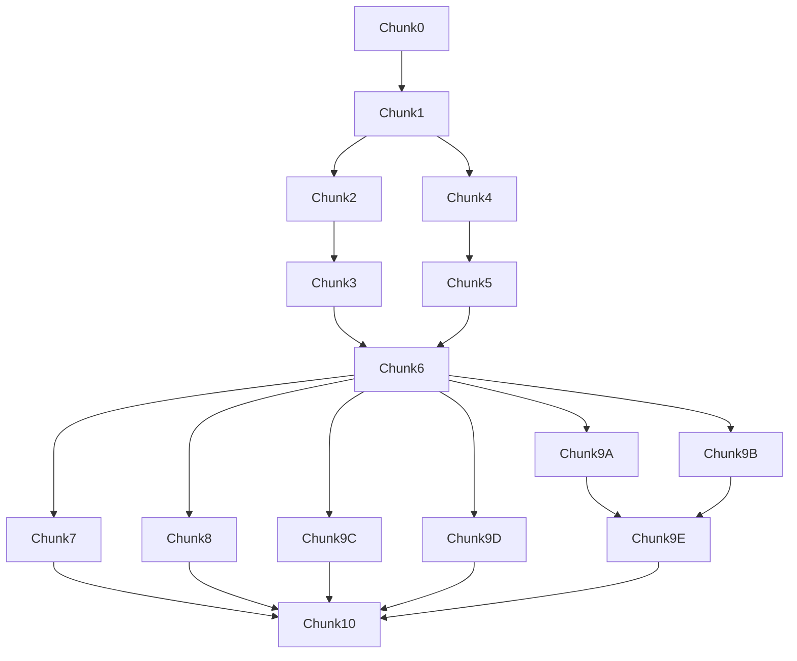

# Quick Event — Agent Implementation Guide

Split into small chunks so an agent can implement **one file at a time** without getting lost.

**This folder is the single source of truth** for product rules, tests, and step-by-step implementation. The Cursor plan (`quick_event_generator`) is a brief summary only.

**TDD:** Run `npm run test` before you start. Each chunk = failing tests → implementation → green tests → `npm run test` again.

---

## Chunk index

| Chunk | Doc | Depends on |
|-------|-----|------------|
| **0** | [00-baseline.md](chunks/00-baseline.md) | — |
| **1** | [01-schema.md](chunks/01-schema.md) | 0 |
| **2** | [02-pure-rules.md](chunks/02-pure-rules.md) | 1 |
| **3** | [03-service.md](chunks/03-service.md) | 1, 2 |
| **4** | [04-event-auth.md](chunks/04-event-auth.md) | 1 |
| **5** | [05-host-permissions.md](chunks/05-host-permissions.md) | 1, 4 |
| **6** | [06-api-routes.md](chunks/06-api-routes.md) | 3, 4, 5 |
| **7** | [07-match-reporting.md](chunks/07-match-reporting.md) | 1, 2, 6 |
| **8** | [08-ui-isolation.md](chunks/08-ui-isolation.md) | 6 |
| **9A** | [09a-event-board.md](chunks/09a-event-board.md) | 6 |
| **9B** | [09b-wizard.md](chunks/09b-wizard.md) | 6 |
| **9C** | [09c-dashboard.md](chunks/09c-dashboard.md) | 6 |
| **9D** | [09d-admin-list.md](chunks/09d-admin-list.md) | 6 |
| **9E** | [09e-app-routes.md](chunks/09e-app-routes.md) | 9A, 9B |
| **10** | [10-regression.md](chunks/10-regression.md) | All |

### Recommended order

**Single agent:** `0 → 1 → 2 → 3 → 4 → 5 → 6 → 7 → 8 → 9A → 9B → 9C → 9D → 9E → 10`

**Parallel agents:** After **6** merges → **7**, **8**, **9A–9D** in parallel → **9E** → **10**

---

## Shared reference (read before any chunk)

- [product-rules.md](product-rules.md) — access, reporting, host limits
- [test-fixtures.md](test-fixtures.md) — stable UUIDs for tests
- [reuse-and-guardrails.md](reuse-and-guardrails.md) — what to reuse / never touch

---

## Dependency graph



---

## PR checklist (copy per chunk)

```markdown
- [ ] Read product-rules.md for this chunk
- [ ] Tests written first and passing for this chunk
- [ ] npm run test --workspace=server (and client if UI chunk)
- [ ] No unrelated refactors
- [ ] Shared types updated if schema changed
```

---

## Related docs

- [FEATURES.md](../FEATURES.md) — Events, match reporting, pairing
- [DATA_MODEL.md](../DATA_MODEL.md) — Event hierarchy
- [testing-tdd.mdc](../../.cursor/rules/testing-tdd.mdc) — TDD workflow
